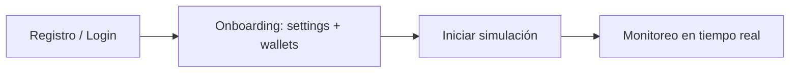
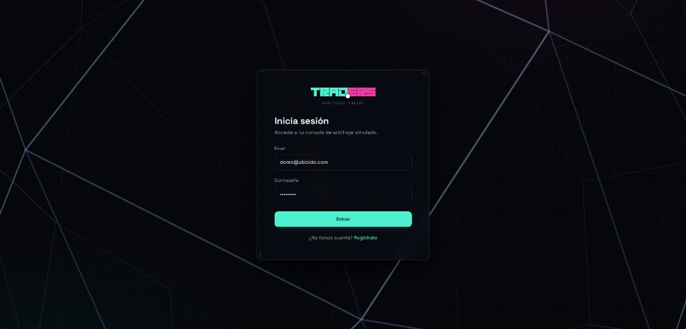
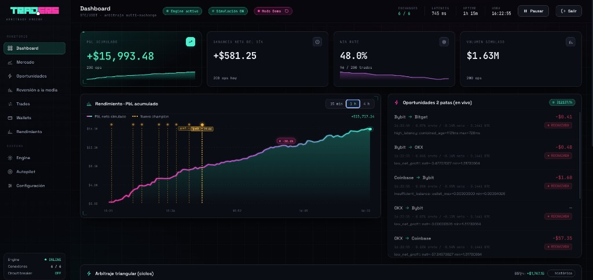
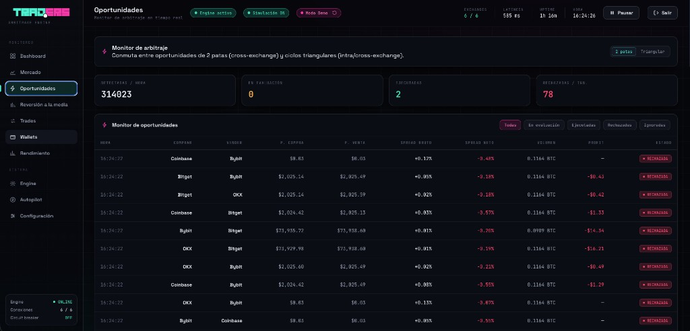
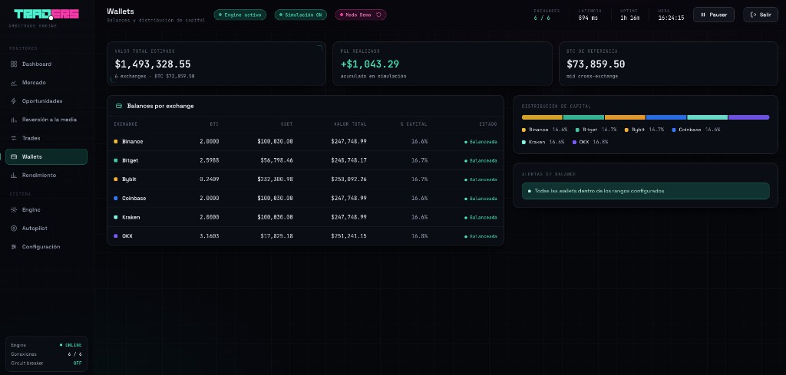
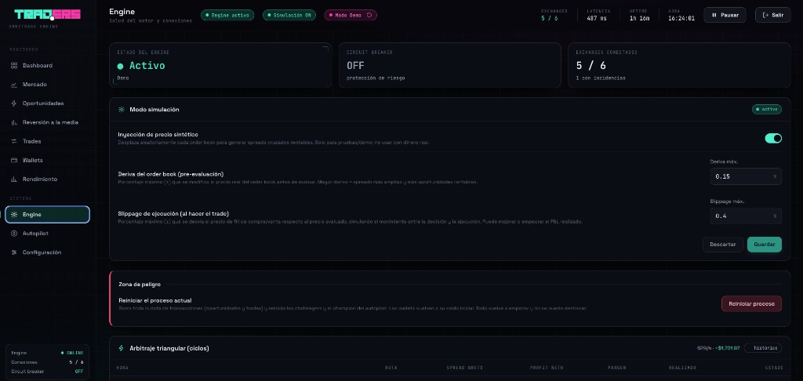
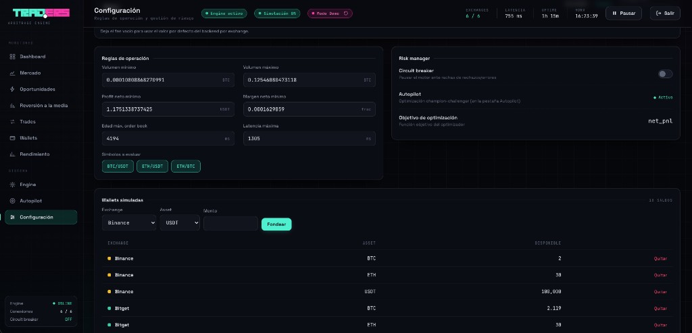
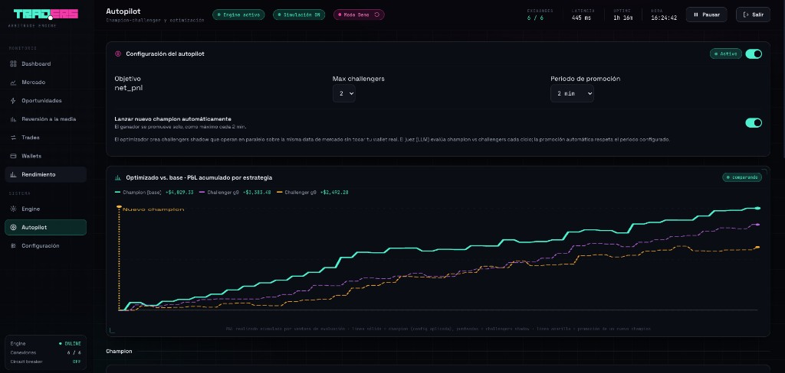
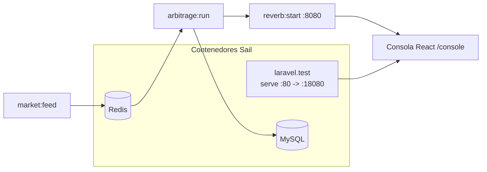

# Nifty Arbitrage Engine — Manual

Plataforma de **evaluación de estrategias de arbitraje de criptomonedas en modo
simulación (paper trading)**. Conecta en tiempo real a varios exchanges, detecta
oportunidades de arbitraje entre ellos y simula la ejecución de operaciones para
medir el rendimiento de tus reglas, **sin mover dinero real**.

Este documento tiene dos partes:

1. [**Guía de uso (usuario final)**](#parte-1--guía-de-uso-usuario-final): qué hace
   la herramienta y cómo operarla desde el navegador.
2. [**Instalación en entorno local**](#parte-2--instalación-en-entorno-local): cómo
   levantar todo el stack en tu máquina (incluye un instalador automatizado).

---

# Parte 1 · Guía de uso (usuario final)

## 1.1 ¿Qué es y para qué sirve?

Nifty mantiene conexiones WebSocket permanentes a los libros de órdenes (order
books) de varios exchanges (Binance, Kraken, Coinbase, Bybit, OKX, Bitget).
Cuando el precio de compra en un exchange es menor que el precio de venta en otro,
existe una **oportunidad de arbitraje**. El motor:

1. Detecta el cruce de precios.
2. Calcula cuánto volumen es realmente ejecutable según la profundidad del libro
   (slippage, fills parciales).
3. Descuenta comisiones (fees), penalización por latencia y costos fijos.
4. Verifica que tu **wallet simulada** tenga saldo para ambas patas.
5. Aplica reglas de riesgo (frescura de datos, volumen mínimo, latencia, margen
   mínimo, circuit breaker).
6. **Simula** la ejecución de la operación y registra el P&L (ganancia/pérdida).

> Importante: **todo es simulado**. Los "monederos" son ledgers virtuales con
> saldo inicial ficticio. La herramienta es para **evaluar estrategias**, no para
> operar con fondos reales.

## 1.2 Conceptos clave

| Concepto | Qué significa |
|---|---|
| **Oportunidad** | Un cruce de precios detectado entre dos exchanges para un símbolo (p. ej. `BTC/USDT`). |
| **Decisión** | El veredicto del motor sobre una oportunidad: `execute` (ejecutar), `reject` (rechazar por no cumplir reglas) o `ignore` (ignorar, p. ej. datos viejos). |
| **Trade simulado** | Una operación que el motor decidió ejecutar; muta tu wallet simulada y genera P&L. |
| **Wallet** | Saldo simulado por activo (USDT, BTC, …). Define cuánto puedes "comprar/vender". |
| **Configuración (reglas)** | Símbolos, umbrales de rentabilidad, frescura, latencia máxima, fees y circuit breaker que controlan qué se ejecuta. |
| **Simulador de oportunidades** | Modo que inyecta una deriva sintética de precios para forzar escenarios rentables (útil porque en mercado real los spreads rara vez cubren los fees). |
| **Estrategia / Autopilot** | Variantes de reglas que compiten entre sí (champion-challenger) para encontrar la mejor configuración. |

## 1.3 Acceso

- **Producción:** <https://trad.ers.lat>
- **Local:** `http://localhost:18080/console` (el puerto por defecto es `18080`; ver Parte 2).

La ruta base redirige automáticamente a la consola, así que basta con abrir el dominio
raíz.

## 1.4 Flujo de primer uso



1. **Registro / Login.** Crea una cuenta (email + contraseña) o inicia sesión. Cada
   usuario tiene su propia configuración, wallets y simulación aisladas.
2. **Onboarding.** Antes de operar debes:
   - Definir tus **reglas** (símbolos a vigilar, umbrales, fees, etc.). Puedes usar
     los valores por defecto.
   - Crear al menos una **wallet con fondos** simulados (p. ej. USDT y BTC).
   - Existe un atajo de **demo** que precarga una configuración y wallets de ejemplo.
3. **Iniciar simulación.** Con el botón **Iniciar** del encabezado. El motor empieza
   a evaluar el flujo de mercado contra tus reglas en vivo.

## 1.5 Las pantallas

Menú lateral, dividido en **Monitoreo** y **Sistema**:

**Monitoreo**

- **Dashboard** — Vista general: estado del engine, oportunidades recientes y
  métricas por símbolo.
- **Mercado** — Order book consolidado multi-exchange en tiempo real.
- **Oportunidades** — Monitor en vivo de cada oportunidad con su decisión
  (`execute` / `reject` / `ignore`) y el motivo.
- **Reversión a la media** — Estrategia complementaria (spot USDT, Binance).
- **Trades** — Historial de operaciones simuladas y P&L total.
- **Wallets** — Balances simulados y distribución de capital.
- **Rendimiento** — Análisis de P&L, curvas de retorno y métricas de calidad.

**Sistema**

- **Engine** — Salud del motor, conexiones por exchange y latencias.
- **Autopilot** — Optimización champion-challenger entre variantes de estrategia.
- **Configuración** — Edición de reglas de operación y gestión de riesgo.

### Capturas de pantalla

**Inicio de sesión** — acceso a la consola con el fondo animado de la red de divisas.



**Dashboard** — P&L acumulado, KPIs del día y oportunidades en vivo.



**Oportunidades** — monitor en tiempo real con decisión (`execute` / `reject` / `ignore`) por oportunidad.



**Wallets** — balances simulados por exchange y distribución de capital.



**Engine** — estado del motor, modo simulación (deriva/slippage) y zona de reinicio.



**Configuración** — reglas de operación, gestión de riesgo y wallets simuladas.



**Autopilot** — optimización champion-challenger y comparación de estrategias.



## 1.6 Controles del encabezado

- **Iniciar / Pausar** — Arranca o detiene tu simulación (no reinicia el proceso de
  fondo; se aplica en caliente).
- **Simulación ON/OFF** — Enciende/apaga el **simulador de oportunidades** (deriva
  sintética de precios). Recomendado en local para ver el motor operar, ya que en
  mercado real los spreads casi nunca superan los fees.
- **Modo Demo (Reiniciar)** — Borra toda tu data simulada (oportunidades, trades,
  challengers) y deja el entorno limpio.
- **Indicadores** — Exchanges en línea, latencia promedio, uptime y hora.

## 1.7 Cómo interpretar una decisión

Cuando abres una oportunidad ves su veredicto y el motivo:

- **`execute`** — Cumple todas las reglas; se simula la operación y se actualiza el
  P&L.
- **`reject`** — Se detectó el cruce pero no pasa algún guard: margen neto por
  debajo del mínimo, volumen insuficiente, latencia alta o circuit breaker activo.
- **`ignore`** — No es accionable (p. ej. datos del libro demasiado viejos respecto
  al umbral de frescura).

> Si no ves ejecuciones, normalmente es correcto: en mercado real el spread no cubre
> los fees. Enciende el **Simulador de oportunidades** (header) o relaja los umbrales
> en **Configuración** para ver el motor ejecutar.

---

# Parte 2 · Instalación en entorno local

El proyecto corre sobre **Docker** mediante **Laravel Sail** (PHP 8.5 + Laravel 13),
con servicios de **MySQL** y **Redis**. El frontend es **React + Vite**, y la capa de
tiempo real usa **Laravel Reverb** (WebSockets).

## 2.1 Requisitos

- **Docker** y **Docker Compose v2** (`docker compose`, no `docker-compose`).
- **Git**.
- Puertos libres en el host: `18080` (app), `8080` (Reverb/WebSocket), `5173`
  (Vite), `3306` (MySQL), `6379` (Redis). Son configurables vía `.env`.
- No necesitas PHP, Composer ni Node instalados en el host: todo corre dentro de los
  contenedores.

## 2.2 Instalación rápida (recomendada)

Se incluye el script `install.sh`, que automatiza todo el proceso de extremo a
extremo y es **idempotente** (puedes volver a correrlo sin romper nada).

```bash
./install.sh
```

El script:

1. Verifica Docker y Docker Compose.
2. Crea el `.env` desde `.env.example` si no existe.
3. Instala dependencias de Composer (usando un contenedor efímero si `vendor/`
   todavía no existe).
4. Levanta los contenedores con Sail (`mysql`, `redis`, `laravel.test`).
5. Genera la `APP_KEY` si falta.
6. Espera a que MySQL esté listo y corre las migraciones.
7. Instala dependencias de Node y compila el frontend.
8. Lanza los procesos de fondo: **Reverb**, **market:feed** y **arbitrage:run**.

Al terminar imprime las URLs de acceso.

Para sólo (re)lanzar los procesos de fondo más adelante (p. ej. tras reiniciar la
máquina), usa:

```bash
./install.sh --workers-only
```

## 2.3 Acceso tras la instalación

- Consola multi-usuario (SPA): <http://localhost:18080/console>
- Health check de la API: <http://localhost:18080/api/v1/health>
- Para desarrollo del frontend con hot-reload, en otra terminal:

```bash
./vendor/bin/sail npm run dev
```

## 2.4 Instalación manual (paso a paso)

Si prefieres no usar el script, estos son los pasos equivalentes.

```bash
# 1) Variables de entorno
cp .env.example .env

# 2) Dependencias de Composer (contenedor efímero la primera vez)
docker run --rm \
  -u "$(id -u):$(id -g)" \
  -v "$(pwd):/var/www/html" -w /var/www/html \
  laravelsail/php84-composer:latest \
  composer install --ignore-platform-reqs --no-interaction

# 3) Levantar contenedores
./vendor/bin/sail up -d

# 4) Clave de la app
./vendor/bin/sail artisan key:generate

# 5) Migraciones
./vendor/bin/sail artisan migrate --force

# 6) Frontend
./vendor/bin/sail npm install
./vendor/bin/sail npm run build
```

Luego levanta los procesos de larga vida (cada uno en background dentro del
contenedor):

```bash
# WebSockets (Reverb)
./vendor/bin/sail artisan reverb:start

# Feed de mercado (conectores WebSocket de exchanges)
./vendor/bin/sail artisan market:feed --exchanges=binance,kraken,coinbase,bybit,okx,bitget

# Engine de arbitraje (event-driven sobre Redis, multi-usuario)
./vendor/bin/sail artisan arbitrage:run
```

## 2.5 Arquitectura de procesos



- `market:feed` ingiere los order books y los publica en Redis (pub/sub).
- `arbitrage:run` consume Redis, evalúa por usuario y persiste en MySQL.
- `reverb:start` distribuye el estado procesado a la SPA por WebSocket.
- `laravel.test` sirve la API REST y la SPA.

> Los workers son procesos PHP persistentes y **no recargan código en caliente**.
> Tras cambiar el backend de un worker, reinícialo (ver `.cursor/rules` del repo o la
> sección de comandos útiles abajo).

## 2.6 Verificación

```bash
# ¿Procesos de fondo arriba?
./vendor/bin/sail exec laravel.test sh -lc "ps aux | grep '[a]rtisan'"

# Health de la API
curl -s http://localhost:18080/api/v1/health

# Suscribirse al stream de mercado (debe mostrar mensajes)
./vendor/bin/sail redis redis-cli psubscribe 'market:*'

# Tests unitarios
./vendor/bin/sail artisan test --testsuite=Unit
```

## 2.7 Comandos útiles

```bash
# Estado / logs de contenedores
./vendor/bin/sail ps
./vendor/bin/sail logs -f laravel.test

# Reiniciar un worker (ejemplo: engine de arbitraje)
./vendor/bin/sail exec laravel.test sh -lc "pkill -f '[a]rtisan arbitrage:run'"; sleep 2
./vendor/bin/sail exec -d laravel.test sh -lc "php artisan arbitrage:run >> storage/logs/engine.out 2>&1"

# Apagar todo
./vendor/bin/sail down

# Apagar y borrar datos (MySQL/Redis)
./vendor/bin/sail down -v
```

## 2.8 Solución de problemas

| Síntoma | Causa probable | Solución |
|---|---|---|
| `vendor/bin/sail: No existe` | Aún no se instaló Composer | Corre el paso 2 de §2.4 o `./install.sh` |
| La consola carga pero no hay datos en vivo | Workers no están corriendo | `./install.sh --workers-only` o §2.5 |
| Puerto ocupado al hacer `up` | Otro servicio usa `18080/8080/3306/6379` | Cambia los puertos en `.env` (`APP_PORT`, `REVERB_PORT`, `FORWARD_DB_PORT`, `FORWARD_REDIS_PORT`) |
| `APP_KEY` vacía / errores de cifrado | Falta generar la clave | `./vendor/bin/sail artisan key:generate` |
| No veo ejecuciones de trades | Spreads reales no cubren fees | Enciende el **Simulador** en el header o relaja umbrales en **Configuración** |
| Cambié backend y no surte efecto | El worker no recarga en caliente | Reinicia el worker afectado (§2.7) |

---

## Documentación relacionada

- [`docs/desarrollo.md`](docs/desarrollo.md) — Guía técnica / de desarrollo: stack,
  comandos Artisan, conectores WebSocket, pipeline del engine de arbitraje, API y tests.
- [`docs/architecture/multiusuario.md`](docs/architecture/multiusuario.md) —
  Arquitectura multiusuario del engine (mercado compartido / estado privado por
  estrategia, sharding, evaluación de desempeño).
