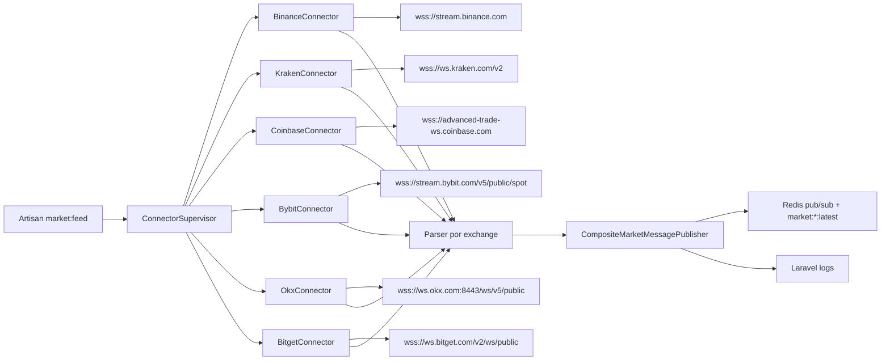

# Coding Challenge Mexico - Laravel 13 + Sail + ReactPHP + Reverb

Proyecto base en Laravel 13 con entorno Docker usando Sail y servicios de MySQL + Redis.

## Requisitos

- Docker
- Docker Compose

## Arranque rapido

1. Levantar contenedores:

```bash
./vendor/bin/sail up -d
```

2. Ejecutar migraciones:

```bash
./vendor/bin/sail artisan migrate
```

3. Levantar servidor websocket de Reverb:

```bash
./vendor/bin/sail artisan reverb:start
```

4. En otra terminal, levantar Vite para el frontend React:

```bash
./vendor/bin/sail npm run dev
```

5. Abrir la aplicacion en [http://localhost:18080](http://localhost:18080) y el frontend React en [http://localhost:18080/app](http://localhost:18080/app).

## Servicios incluidos en Sail

- `laravel.test` (app PHP/Laravel)
- `mysql` (MySQL 5.7)
- `redis` (Redis alpine)

La configuracion esta en `compose.yaml`, `docker/sail/Dockerfile` y variables por defecto en `.env` / `.env.example`.

## Demo de paralelismo con ReactPHP

Se incluye un mecanismo de paralelismo basado en ReactPHP que ejecuta tareas en procesos hijos y controla concurrencia maxima.

Comando principal:

```bash
./vendor/bin/sail artisan tasks:parallel-demo --tasks=8 --max=4
```

Opciones:

- `--tasks`: cantidad de tareas a simular
- `--max`: maximo de tareas corriendo en paralelo

Comando worker interno (usado por el runner):

```bash
./vendor/bin/sail artisan react:task-worker 1 2
```

## Arquitectura base API + React + Reverb

- API versionada en `routes/api.php` bajo prefijo `/api/v1`.
- Endpoint de estado: `GET /api/v1/health`.
- Endpoint para publicar mensajes en tiempo real: `POST /api/v1/messages`.
- Evento broadcast: `App\Events\FrontendMessageSent` en canal público `frontend-messages`.
- Frontend React inicial: `resources/js/app.jsx`.
- Configuración websocket cliente: `resources/js/echo.js`.

Variables requeridas:

- `BROADCAST_CONNECTION=reverb`
- `REVERB_*` y `VITE_REVERB_*` en `.env`

Flujo de comunicación:

1. React envía `POST /api/v1/messages`.
2. Laravel valida y dispara el evento broadcast.
3. Reverb distribuye el evento al canal `frontend-messages`.
4. React escucha `.frontend.message.sent` y actualiza la UI en tiempo real.

## Archivos clave

- `compose.yaml`: stack Docker de Sail + MySQL + Redis + servicio opcional `market-feed`
- `routes/console.php`: comandos Artisan para demo y worker
- `app/Services/Parallel/ReactParallelRunner.php`: orquestador de paralelismo con ReactPHP
- `app/Console/Commands/MarketFeedCommand.php`: comando de larga vida para conectores WS
- `app/Domain/MarketData/`: contratos y DTOs normalizados (ticker / orderbook)
- `app/Infrastructure/MarketData/`: cliente WS con ReactPHP, supervisor, publishers (Redis/Logger) y conectores por exchange
- `config/marketdata.php`: configuración del feed de mercado

## Conectores WebSocket de exchanges (always-on)

Se incluye una arquitectura para mantener conexiones WebSocket persistentes a varios exchanges, normalizar los mensajes y publicarlos en Redis (pub/sub + último estado).

### Componentes



- Reconexión automática con backoff exponencial + jitter ([`BackoffStrategy`](app/Infrastructure/MarketData/Supervisor/BackoffStrategy.php)).
- Re-suscripción tras reconectar.
- Estado de salud por exchange (último mensaje, intentos fallidos) reportado periódicamente.
- Publicación dual: pub/sub a `market:<stream>:<exchange>:<symbol>` y snapshot del último mensaje en `market:<stream>:<exchange>:<symbol>:latest`.
- Métricas de refresco por stream (`ticker` y `orderbook`): `inter_arrival_ms` p50/p95/p99, `source_to_ingest_ms` p50/p95/p99 y `estimated_refresh_hz`.

### Exchanges soportados

- `binance` — `wss://stream.binance.com:9443/stream` (ticker `@ticker`, orderbook `@depth20@100ms`).
- `kraken` — `wss://ws.kraken.com/v2` (canales `ticker` y `book`).
- `coinbase` — `wss://advanced-trade-ws.coinbase.com` (canales `ticker` y `level2`).
- `bybit` — `wss://stream.bybit.com/v5/public/spot` (topics `tickers.<symbol>` y `orderbook.50.<symbol>`).
- `okx` — `wss://ws.okx.com:8443/ws/v5/public` (canales `tickers` y `books`).
- `bitget` — `wss://ws.bitget.com/v2/ws/public` (canales `ticker` y `books`).

### Levantar el feed

```bash
./vendor/bin/sail artisan market:feed --exchanges=binance,kraken,coinbase,bybit,okx,bitget
```

Opciones:

- `--exchanges=binance,kraken,coinbase,bybit,okx,bitget`
- `--symbols=BTC/USDT,ETH/USDT` (formato normalizado, cada conector lo traduce a su formato)
- `--streams=ticker,orderbook`
- `--no-redis` (solo loguear, útil sin Redis)
- `--quiet-logs` (no escribir un log por cada mensaje recibido)
- `--duration=60` (detener el listener tras N segundos, útil para smoke tests)

Las variables `MARKET_FEED_*` en `.env` definen los valores por defecto cuando no se pasan flags.

### Monitor de frecuencia de refresco

Cada `MARKET_FEED_STATUS_INTERVAL` segundos, el log `storage/logs/laravel.log` emite un bloque:

```text
[market-feed][status] {
  "<exchange>": {
    "metrics": {
      "ticker": {
        "inter_arrival_ms": {"p50": ..., "p95": ..., "p99": ...},
        "source_to_ingest_ms": {"p50": ..., "p95": ..., "p99": ...},
        "estimated_refresh_hz": ...
      },
      "orderbook": { ... }
    }
  }
}
```

Esto te da un monitor rápido de cadencia real y latencia de ingestión sin depender de observabilidad externa.

### Suscribirse a los streams

```bash
./vendor/bin/sail redis redis-cli psubscribe 'market:*'
```

### Smoke test rápido

```bash
./vendor/bin/sail artisan market:feed --exchanges=binance --symbols=BTC/USDT --streams=ticker --duration=15
tail -f storage/logs/laravel.log
```

### Operación como servicio en Sail

El servicio opcional `market-feed` está definido en `compose.yaml` bajo el profile `feed` para no arrancar por defecto:

```bash
./vendor/bin/sail --profile feed up -d market-feed
```

### Tests

```bash
./vendor/bin/sail artisan test --testsuite=Unit
```

Cubren parsers de Binance, Kraken, Coinbase, Bybit, OKX y Bitget, además del supervisor (subscribe + reconexión).

## Engine de arbitraje (`app/Arbitrage`)

Engine de arbitraje de BTC cross-exchange, desacoplado del dashboard y de los controllers. Corre como proceso persistente y **event-driven**: cada update de order book publicado por `market:feed` en Redis dispara el pipeline completo de evaluación en memoria.

### Pipeline

```mermaid
flowchart LR
    feed[market:feed] --> redis["Redis Pub/Sub market:orderbook:*"]
    redis --> sub[RedisMarketSubscriber ReactPHP]
    sub --> store[OrderBookStore in-memory]
    store --> scan[ArbitrageScanner]
    scan --> liq[LiquidityCalculator]
    liq --> profit[ProfitabilityCalculator]
    profit --> wallet[WalletValidator]
    wallet --> risk[RiskManager + Guards + CircuitBreaker]
    risk --> exec[ExecutionSimulator single-writer]
    exec --> buffer[PersistenceBuffer]
    buffer --> mysql[(MySQL)]
    exec --> dash[ReverbDashboardPublisher]
    dash --> react[React dashboard]
```



1. **Ingestión / normalización**: reutiliza `market:feed` (no se reescribe).
2. **OrderBookStore**: último book válido por `(exchange, symbol)` con best bid/ask, frescura y latencia, en memoria.
3. **ArbitrageScanner**: ante cada update compara contra books frescos de otros exchanges; candidato si `buy_ask < sell_bid`.
4. **LiquidityCalculator**: recorre profundidad, calcula volumen ejecutable y precios promedio ponderados (slippage real, fills parciales).
5. **ProfitabilityCalculator**: profit bruto y neto descontando fees, penalización por latencia y costo fijo.
6. **WalletValidator**: define volumen final según USDT (comprador) y BTC (vendedor) disponibles.
7. **RiskManager**: guards (`freshness`, `min_volume`, `latency`, `min_profit`) + `CircuitBreaker` → decisión `execute | reject | ignore`.
8. **ExecutionSimulator**: **único** componente que muta balances (single-writer), con idempotencia por oportunidad; simula ambas patas y calcula P&L.
9. **Persistencia desacoplada**: `PersistenceBuffer` agrupa por lote/tiempo fuera del camino crítico; solo persiste eventos relevantes (no cada tick).
10. **Dashboard**: `ReverbDashboardPublisher` publica estado ya procesado (con throttle) + snapshot en cache para el primer render REST.

### Reglas de diseño respetadas

- Engine separado del dashboard, modelos y controllers; conectores intercambiables por interfaces.
- Procesamiento crítico en memoria; no se guarda cada tick en DB.
- `single-writer` de wallets: solo `ExecutionSimulator` escribe balances.
- La UI no calcula arbitraje; solo consume estado procesado vía API + Reverb.
- Contratos (`app/Arbitrage/Contracts`) permiten reemplazar el engine sin tocar dashboard/modelos/frontend.

### Levantar el engine

```bash
# 1) Ingestión de mercado
./vendor/bin/sail artisan market:feed --exchanges=binance,kraken,coinbase

# 2) Engine de arbitraje (event-driven sobre Redis)
./vendor/bin/sail artisan arbitrage:run
```

Opciones de `arbitrage:run`:

- (sin flags) **modo multi-usuario**: levanta un engine por cada simulación activa y reconcilia altas/bajas en caliente cada 3 s.
- `--user=ID` (ejecutar solo para un usuario)
- `--global` (engine único sin scoping por usuario; usa `config('arbitrage')`)
- `--symbols=BTC/USDT` (override en modo `--global`)
- `--no-persistence` (no escribir en DB)
- `--no-dashboard` (no publicar a Reverb)
- `--duration=30` (detener tras N segundos; smoke tests)

La configuración base vive en `config/arbitrage.php` (fees por exchange, umbrales, latencia, circuit breaker, balances iniciales, persistencia y dashboard), parametrizable vía variables `ARBITRAGE_*` en `.env`. En modo multi-usuario cada usuario sobreescribe esos valores con su `arbitrage_settings`.

### Multi-usuario (auth + onboarding + simulación personal)

El sistema es multi-tenant: cada usuario tiene su propia configuración, wallets y simulación.

- **Auth (Sanctum, token Bearer)**: `POST /api/v1/auth/register`, `POST /api/v1/auth/login`, `GET /api/v1/auth/me`, `POST /api/v1/auth/logout`.
- **Configuración**: `GET/PUT /api/v1/arbitrage/settings` (símbolos, umbrales, frescura, latencia, fees override, circuit breaker, flag `onboarded`).
- **Wallets**: `GET/POST /api/v1/arbitrage/wallets`, `DELETE /api/v1/arbitrage/wallets/{id}` (saldos simulados por usuario).
- **Simulación**: `GET /api/v1/arbitrage/simulation` (estado + stats), `POST .../simulation/start`, `POST .../simulation/stop`. Iniciar requiere onboarding completo y al menos una wallet con fondos.
- **Dashboard scoping**: cada usuario consume su estado vía los endpoints anteriores y escucha su **canal privado** `private-arbitrage.user.{id}` (autorizado por Sanctum en `/api/broadcasting/auth`).

`arbitrage:run` (sin flags) carga las `simulation_runs` activas, levanta un `EngineRuntime` por usuario (estado de mercado + wallets + riesgo aislados) y persiste oportunidades/trades/wallets con `user_id`. Las sesiones que se inician/detienen desde la API se reflejan en caliente sin reiniciar el proceso.

### Frontend SPA multi-usuario

`resources/js/spa/*`, ruta [http://localhost:18080/console](http://localhost:18080/console). Genérico y funcional (login/registro → onboarding de settings+wallets → panel de monitoreo con start/stop y flujo en vivo por el canal privado).

### Monitor de consola en tiempo real (`arbitrage:monitor`)

TUI para observar el motor de evaluación en vivo mientras se construye la UI web. Levanta un engine efímero con wallets/configuración **arbitrarias** (flags), consume Redis y redibuja métricas, wallets, decisiones (color por `execute`/`reject`/`ignore` con su motivo) y trades simulados. No persiste ni publica a Reverb.

```bash
# Terminal A: ingestión
./vendor/bin/sail artisan market:feed

# Terminal B: monitor (fee 0 y margen relajado para ver ejecuciones)
./vendor/bin/sail artisan arbitrage:monitor --fee=0 --min-margin=0 --min-profit=0.01
```

Flags: `--symbols=`, `--usdt=` y `--btc=` (saldo por exchange), `--fee=` (uniforme), `--min-profit=`, `--min-margin=`, `--refresh=` (ms), `--duration=` (segundos).

### API del dashboard (`/api/v1/arbitrage`, requiere auth)

- `GET /api/v1/arbitrage` — snapshot por símbolo del usuario (cache).
- `GET /api/v1/arbitrage/{symbol}` — detalle por símbolo.
- `GET /api/v1/arbitrage/opportunities?decision=execute&symbol=BTC/USDT` — histórico del usuario.
- `GET /api/v1/arbitrage/trades` — trades simulados del usuario + P&L total.
- `GET /api/v1/arbitrage/wallets` — balances simulados del usuario.

El dashboard legacy single-tenant (`resources/js/dashboard.jsx`, canal público `arbitrage-dashboard`) sigue disponible y se alimenta con `arbitrage:run --global`.

### Modelos / persistencia

`Exchange`, `WalletBalance`, `Opportunity`, `Trade`, `TradeFill`, `BotEvent` (con `user_id`), más `ArbitrageSetting` y `SimulationRun` para multi-tenancy (migraciones `2026_05_29_*`).

### Smoke test end-to-end

```bash
# Terminal A
./vendor/bin/sail artisan arbitrage:run --duration=30 --no-dashboard

# Terminal B: publicar dos books cruzados
./vendor/bin/sail artisan tinker --execute='
use Illuminate\Support\Facades\Redis;
$mk=fn($ex,$b,$a)=>json_encode(["type"=>"orderbook","exchange"=>$ex,"symbol"=>"BTC/USDT","bids"=>$b,"asks"=>$a,"timestamp_ms"=>(int)(microtime(true)*1000),"is_snapshot"=>true]);
$c=Redis::connection("default");
$c->publish("market:orderbook:binance:btc-usdt",$mk("binance",[["99900","2"]],[["100000","2"]]));
$c->publish("market:orderbook:kraken:btc-usdt",$mk("kraken",[["100500","2"]],[["100600","2"]]));
'
# Verificar
./vendor/bin/sail artisan tinker --execute='echo App\Models\Trade::count();'
```

### Tests del engine

```bash
./vendor/bin/sail artisan test --testsuite=Unit
```

Cubren `OrderBookStore`, `ArbitrageScanner`, `LiquidityCalculator`, `ProfitabilityCalculator`, `WalletManager` (single-writer atómico), `ExecutionSimulator` (idempotencia + balances), `RiskManager` (guards + circuit breaker) y el pipeline completo (`ArbitrageEngine`).
