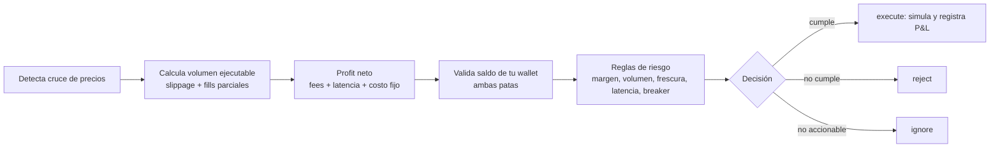
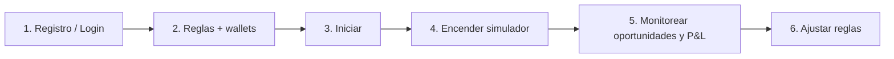
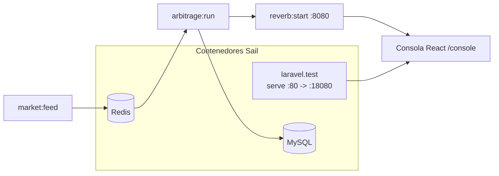

# Trad.ERS — Arbitraje · Manual

Plataforma de **evaluación de estrategias de arbitraje de criptomonedas en modo
simulación (paper trading)**. Conecta en tiempo real a varios exchanges, detecta
oportunidades de arbitraje entre ellos y simula la ejecución de operaciones para
medir el rendimiento de tus reglas, **sin mover dinero real**.

El **mecanismo de arbitraje es el núcleo de la herramienta** (y del challenge):
todo lo demás —wallets, métricas, autopilot, pantallas— existe para configurarlo,
alimentarlo y medir su desempeño. Esta guía está organizada para que puedas
**operar el arbitraje de principio a fin**.

Este documento tiene dos partes:

1. [**Guía de uso (usuario final)**](#parte-1--guía-de-uso-usuario-final): qué hace
   la herramienta y, sobre todo, **cómo operar el mecanismo de arbitraje** desde el
   navegador.
2. [**Instalación en entorno local**](#parte-2--instalación-en-entorno-local): cómo
   levantar todo el stack en tu máquina (incluye un instalador automatizado).

---

# Parte 1 · Guía de uso (usuario final)

## 1.1 ¿Qué es y para qué sirve?

Trad.ERS mantiene conexiones WebSocket permanentes a los libros de órdenes (order
books) de varios exchanges (Binance, Kraken, Coinbase, Bybit, OKX, Bitget) y busca,
en cada actualización de precios, **oportunidades de arbitraje** que cumplan tus
reglas. Cuando encuentra una rentable, **simula** la operación y registra su P&L
(ganancia/pérdida).

> Importante: **todo es simulado**. Los "monederos" son ledgers virtuales con
> saldo inicial ficticio. La herramienta es para **evaluar estrategias de
> arbitraje**, no para operar con fondos reales.

## 1.2 El mecanismo de arbitraje (cómo detecta y ejecuta)

Es la pieza central. El motor soporta **dos tipos de arbitraje**:

- **Cross-exchange (2 patas)** — el caso principal. Compra el activo donde está
  más barato y lo vende donde está más caro **al mismo tiempo**. Ejemplo: comprar
  `BTC/USDT` en Binance a 99 900 y venderlo en Kraken a 100 500.
- **Triangular (multi-pata)** — un ciclo cerrado de conversiones que vuelve al
  activo de partida (p. ej. `USDT → BTC → ETH → USDT`), intra-exchange o
  cross-exchange. Es opcional y se observa en el panel de **Ciclos** del Engine.

Para **cada** order book nuevo que llega, el motor ejecuta este pipeline y termina
con una **decisión**:



1. **Cruce.** El precio de compra (ask) en un exchange es menor que el de venta
   (bid) en otro.
2. **Liquidez.** Recorre la profundidad del libro para saber cuánto volumen es
   realmente ejecutable (con slippage y fills parciales), no solo el mejor precio.
3. **Rentabilidad.** Calcula el profit **neto** descontando comisiones (fees),
   penalización por latencia y costo fijo.
4. **Wallet.** Verifica que tengas saldo para ambas patas (USDT para comprar, BTC
   para vender) y ajusta el volumen al saldo disponible.
5. **Riesgo.** Aplica los guards (margen mínimo, volumen mínimo, frescura de datos,
   latencia máxima) y el circuit breaker.
6. **Ejecución simulada.** Si todo pasa, simula ambas patas, muta tu wallet y suma
   el P&L.

> En **mercado real** los spreads casi nunca superan los fees, así que verás
> muchos `reject`/`ignore` y pocas (o ninguna) ejecución. Para **ver el motor
> operar** se enciende el simulador de precios (ver §1.5, paso 4). Esto es esperado
> y correcto.

## 1.3 Conceptos clave

| Concepto | Qué significa |
|---|---|
| **Oportunidad** | Un cruce de precios detectado entre dos exchanges para un símbolo (p. ej. `BTC/USDT`). |
| **Decisión** | El veredicto del motor sobre una oportunidad: `execute` (ejecutar), `reject` (rechazar por no cumplir reglas) o `ignore` (ignorar, p. ej. datos viejos). |
| **Trade simulado** | Una operación que el motor decidió ejecutar; muta tu wallet simulada y genera P&L. |
| **Wallet** | Saldo simulado por activo (USDT, BTC, …) **por exchange**. Define cuánto puedes "comprar/vender" en cada pata. |
| **Configuración (reglas)** | Símbolos, umbrales de rentabilidad, frescura, latencia máxima, fees y circuit breaker que controlan qué se ejecuta. Ver §1.6. |
| **Simulador de precios** | Modo (pantalla **Engine**) que inyecta una deriva sintética de precios para forzar escenarios rentables (útil porque en mercado real los spreads rara vez cubren los fees). |
| **Agente / Autopilot** | Variantes de reglas que compiten entre sí (champion-challenger) para encontrar la mejor configuración. Vive en el menú **Global → Agente**. |

## 1.4 Acceso

- **Producción:** <https://trad.ers.lat>
- **Local:** `http://localhost:18080/console` (el puerto por defecto es `18080`; ver Parte 2).

La ruta base redirige automáticamente a la consola, así que basta con abrir el dominio
raíz.

## 1.5 Puesta en marcha: del registro a tu primer arbitraje

Esta es la **receta operativa** para llegar a ver ejecuciones de arbitraje.



1. **Registro / Login.** Crea una cuenta (email + contraseña) o inicia sesión. Cada
   usuario tiene su propia configuración, wallets y simulación aisladas.
2. **Onboarding (reglas + wallets).** Antes de operar:
   - Define tus **reglas** en **Arbitraje → Configuración** (símbolos a vigilar,
     umbrales, fees). Puedes dejar los valores por defecto.
   - Crea al menos una **wallet con fondos** simulados. Para arbitraje cross-exchange
     necesitas **saldo en ambos lados**: USDT (para comprar) y BTC (para vender),
     idealmente repartido en los exchanges que vigilas. El atajo de **demo**
     precarga configuración y wallets de ejemplo.
3. **Iniciar.** Pulsa **Iniciar** en el encabezado. El motor empieza a evaluar el
   flujo de mercado contra tus reglas en vivo. Requiere onboarding completo y al
   menos una wallet con fondos.
4. **Encender el simulador de precios.** En **Arbitraje → Engine → Modo
   simulación**, activa **"Inyección de precio sintético"** y sube la **"Deriva del
   order book"** (p. ej. `0.10–0.30 %`). También puedes usar el toggle
   **Simulación** del encabezado. Sin esto, en mercado real rara vez verás
   ejecuciones (los fees se comen el spread). El cambio se aplica en caliente en
   unos segundos.
5. **Monitorear.** En **Arbitraje → Oportunidades** ves cada cruce con su decisión,
   en **Arbitraje → Resumen** el P&L acumulado, y en **Global → Trades** el
   historial de operaciones simuladas.
6. **Ajustar.** Si no ves ejecuciones, usa el **Embudo de descartes** en **Arbitraje
   → Engine** (§1.7) para ver en qué etapa se cae cada cruce y afina las reglas
   (§1.6).

## 1.6 Las reglas del arbitraje (parámetros)

Se editan en **Arbitraje → Configuración** y controlan **qué se ejecuta**. Todas se
aplican en caliente al guardar.

| Regla (UI) | Qué controla | Para ver **más** ejecuciones |
|---|---|---|
| **Símbolos a evaluar** | Qué pares vigila el motor (p. ej. `BTC/USDT`). | Activa solo los que tengan feed fresco. |
| **Profit neto mínimo** (USDT) | Ganancia neta mínima por operación tras fees/costos. | Bájalo. |
| **Margen neto mínimo** (frac.) | Ganancia neta mínima como fracción del notional (`0.0005` = 0.05 %). | Bájalo. |
| **Volumen mínimo** (BTC) | Tamaño mínimo ejecutable para considerar la operación. | Bájalo. |
| **Volumen máximo** (BTC) | Tope de tamaño por operación. | Súbelo si tu wallet lo permite. |
| **Edad máx. order book** (ms) | Frescura: descarta libros más viejos que esto. | Súbelo (cuidado: datos stale). |
| **Latencia máxima** (ms) | Rechaza si los libros combinados están muy atrasados. | Súbelo. |
| **Fee taker (%)** por exchange | Comisión que se descuenta del profit. Vacío = valor por defecto del backend. | Bájalo para pruebas. |
| **Circuit breaker** | Pausa el par tras una racha de rechazos/errores. | Mantenlo activo en operación normal. |

> Atajo para pruebas: con **fees a 0** y **profit/margen mínimos muy bajos**, casi
> cualquier cruce se ejecuta. Útil para validar el pipeline; poco realista para
> evaluar una estrategia.

## 1.7 Las pantallas

La consola es un **hub de estrategias**. Al abrir la app entras directamente en
**Arbitraje** (la estrategia principal). El menú lateral tiene dos grupos:

**Estrategias** (cada una con sus propias pestañas)

- **Arbitraje** — La estrategia cross-exchange. Es el corazón de la herramienta y
  se abre por defecto. Dentro tiene cuatro pestañas:
  - **Resumen** — P&L acumulado, KPIs del día y oportunidades de 2 patas en vivo.
  - **Oportunidades** — Monitor de cada cruce con su decisión (`execute` /
    `reject` / `ignore`) y el motivo. Incluye el conmutador **2 patas /
    Triangular** (ciclos).
  - **Engine** — Salud del motor, conexiones por exchange, **Modo simulación**
    (deriva/slippage), **Eficiencia del motor**, embudo de descartes y zona de
    reinicio.
  - **Configuración** — Reglas de operación (umbrales, frescura, latencia), fees
    por exchange, gestión de riesgo y wallets simuladas.
- **Trading** — Estrategias long/short simuladas (pestañas General, Señales,
  Posiciones, Configuración, Agente).

  > ⚠️ **Módulo experimental.** El módulo de Trading **no forma parte de lo que
  > pide el reto** (cuyo núcleo es el arbitraje cross-exchange) y se incluye como
  > extra en desarrollo. Puede presentar **comportamientos extraños o inestables**
  > (métricas inconsistentes, instancias que tardan en "calentar", señales que no
  > se materializan). Úsalo solo de forma exploratoria; **la estrategia soportada y
  > la que debes evaluar es Arbitraje.**
- **Resumen** — Hub consolidado de todas tus estrategias.

**Global** (vistas transversales a todas las estrategias)

- **Mercado** — Order book consolidado multi-exchange en tiempo real.
- **Wallets** — Balances simulados y distribución de capital.
- **Rendimiento** — Análisis de P&L, curvas de retorno y métricas de calidad.
- **Trades** — Historial de operaciones simuladas y P&L total.
- **Agente** — Asesor IA + modo autónomo (optimización champion-challenger).

> **Configuración de cuenta** (preferencias y sesión) está en el botón de tu
> perfil, abajo del todo del menú. No confundir con la pestaña **Configuración**
> del Arbitraje, que contiene las reglas del motor.

### Capturas de pantalla

**Inicio de sesión** — acceso a la consola con el fondo animado de la red de divisas.


**Arbitraje · Resumen** — P&L acumulado, KPIs del día y oportunidades en vivo.


**Oportunidades** — monitor en tiempo real con decisión (`execute` / `reject` / `ignore`) por oportunidad.


**Wallets** — balances simulados por exchange y distribución de capital.


**Engine** — estado del motor, modo simulación (deriva/slippage) y zona de reinicio.


**Configuración** — reglas de operación, gestión de riesgo y wallets simuladas.


**Agente (autopilot)** — optimización champion-challenger y comparación de estrategias.


## 1.8 Controles del encabezado

- **Iniciar / Pausar** — Arranca o detiene tu simulación (no reinicia el proceso de
  fondo; se aplica en caliente).
- **Simulación ON/OFF** — Enciende/apaga el **simulador de precios** (deriva
  sintética). Recomendado en local para ver el motor operar, ya que en mercado real
  los spreads casi nunca superan los fees.
- **Modo Demo (Reiniciar)** — Borra toda tu data simulada (oportunidades, trades,
  challengers) y deja el entorno limpio.
- **Indicadores** — Exchanges en línea, latencia promedio, uptime y hora.

## 1.9 Interpretar una decisión y diagnosticar por qué no se ejecuta

Cada oportunidad termina en una de tres decisiones:

- **`execute`** — Cumple todas las reglas; se simula la operación y se actualiza el
  P&L.
- **`reject`** — Se detectó el cruce pero no pasa algún guard: margen/profit neto
  por debajo del mínimo, volumen insuficiente, latencia alta, saldo de wallet
  insuficiente o circuit breaker activo.
- **`ignore`** — No es accionable (p. ej. datos del libro demasiado viejos respecto
  al umbral de frescura, o no hubo cruce de precios).

**¿No ves ejecuciones?** Es lo normal sin el simulador encendido. Para diagnosticar,
abre **Arbitraje → Engine → Embudo de descartes**: muestra cuántos cruces se caen en cada etapa
(sin liquidez, spread no cruzado, sin volumen ejecutable, rechazo de wallet o de
riesgo). Eso te dice exactamente qué regla relajar:

- Se caen en **margen/profit** → baja **Profit/Margen neto mínimo** o los **fees**.
- Se caen en **frescura/latencia** → sube **Edad máx. order book** o **Latencia máxima**.
- Se caen en **wallet** → fondea más saldo (USDT y BTC) en los exchanges del cruce.
- **No hay cruces** → enciende el **simulador de precios** y sube la **deriva** (§1.5, paso 4).

---

# Parte 2 · Instalación en entorno local

El proyecto corre sobre **Docker** mediante **Laravel Sail** (PHP 8.5 + Laravel 13),
con servicios de **MySQL** y **Redis**. El frontend es **React + Vite**, y la capa de
tiempo real usa **Laravel Reverb** (WebSockets).

## 2.1 Requisitos

- **Docker** y **Docker Compose v2** (`docker compose`, no `docker-compose`).
- **Git**.
- Puertos libres en el host: `18080` (app), `8080` (Reverb/WebSocket), `5173`
  (Vite), `3306` (MySQL), `6379` (Redis). Son configurables vía `.env`.
- No necesitas PHP, Composer ni Node instalados en el host: todo corre dentro de los
  contenedores.

## 2.2 Instalación rápida (recomendada)

Se incluye el script `install.sh`, que automatiza todo el proceso de extremo a
extremo y es **idempotente** (puedes volver a correrlo sin romper nada).

```bash
./install.sh
```

El script:

1. Verifica Docker y Docker Compose.
2. Crea el `.env` desde `.env.example` si no existe.
3. Instala dependencias de Composer (usando un contenedor efímero si `vendor/`
   todavía no existe).
4. Levanta los contenedores con Sail (`mysql`, `redis`, `laravel.test`).
5. Genera la `APP_KEY` si falta.
6. Espera a que MySQL esté listo y corre las migraciones.
7. Instala dependencias de Node y compila el frontend.
8. Lanza los procesos de fondo: **Reverb**, **market:feed** y **arbitrage:run**.

Al terminar imprime las URLs de acceso.

Para sólo (re)lanzar los procesos de fondo más adelante (p. ej. tras reiniciar la
máquina), usa:

```bash
./install.sh --workers-only
```

## 2.3 Acceso tras la instalación

- Consola multi-usuario (SPA): <http://localhost:18080/console>
- Health check de la API: <http://localhost:18080/api/v1/health>
- Para desarrollo del frontend con hot-reload, en otra terminal:

```bash
./vendor/bin/sail npm run dev
```

## 2.4 Instalación manual (paso a paso)

Si prefieres no usar el script, estos son los pasos equivalentes.

```bash
# 1) Variables de entorno
cp .env.example .env

# 2) Dependencias de Composer (contenedor efímero la primera vez)
docker run --rm \
  -u "$(id -u):$(id -g)" \
  -v "$(pwd):/var/www/html" -w /var/www/html \
  laravelsail/php84-composer:latest \
  composer install --ignore-platform-reqs --no-interaction

# 3) Levantar contenedores
./vendor/bin/sail up -d

# 4) Clave de la app
./vendor/bin/sail artisan key:generate

# 5) Migraciones
./vendor/bin/sail artisan migrate --force

# 6) Frontend
./vendor/bin/sail npm install
./vendor/bin/sail npm run build
```

Luego levanta los procesos de larga vida (cada uno en background dentro del
contenedor):

```bash
# WebSockets (Reverb)
./vendor/bin/sail artisan reverb:start

# Feed de mercado (conectores WebSocket de exchanges)
./vendor/bin/sail artisan market:feed --exchanges=binance,kraken,coinbase,bybit,okx,bitget

# Engine de arbitraje (event-driven sobre Redis, multi-usuario)
./vendor/bin/sail artisan arbitrage:run
```

## 2.5 Arquitectura de procesos



- `market:feed` ingiere los order books y los publica en Redis (pub/sub).
- `arbitrage:run` consume Redis, evalúa por usuario y persiste en MySQL.
- `reverb:start` distribuye el estado procesado a la SPA por WebSocket.
- `laravel.test` sirve la API REST y la SPA.

> Los workers son procesos PHP persistentes y **no recargan código en caliente**.
> Tras cambiar el backend de un worker, reinícialo (ver `.cursor/rules` del repo o la
> sección de comandos útiles abajo).

## 2.6 Verificación

```bash
# ¿Procesos de fondo arriba?
./vendor/bin/sail exec laravel.test sh -lc "ps aux | grep '[a]rtisan'"

# Health de la API
curl -s http://localhost:18080/api/v1/health

# Suscribirse al stream de mercado (debe mostrar mensajes)
./vendor/bin/sail redis redis-cli psubscribe 'market:*'

# Tests unitarios
./vendor/bin/sail artisan test --testsuite=Unit
```

## 2.7 Comandos útiles

```bash
# Estado / logs de contenedores
./vendor/bin/sail ps
./vendor/bin/sail logs -f laravel.test

# Reiniciar un worker (ejemplo: engine de arbitraje)
./vendor/bin/sail exec laravel.test sh -lc "pkill -f '[a]rtisan arbitrage:run'"; sleep 2
./vendor/bin/sail exec -d laravel.test sh -lc "php artisan arbitrage:run >> storage/logs/engine.out 2>&1"

# Apagar todo
./vendor/bin/sail down

# Apagar y borrar datos (MySQL/Redis)
./vendor/bin/sail down -v
```

## 2.8 Solución de problemas

| Síntoma | Causa probable | Solución |
|---|---|---|
| `vendor/bin/sail: No existe` | Aún no se instaló Composer | Corre el paso 2 de §2.4 o `./install.sh` |
| La consola carga pero no hay datos en vivo | Workers no están corriendo | `./install.sh --workers-only` o §2.5 |
| Puerto ocupado al hacer `up` | Otro servicio usa `18080/8080/3306/6379` | Cambia los puertos en `.env` (`APP_PORT`, `REVERB_PORT`, `FORWARD_DB_PORT`, `FORWARD_REDIS_PORT`) |
| `APP_KEY` vacía / errores de cifrado | Falta generar la clave | `./vendor/bin/sail artisan key:generate` |
| No veo ejecuciones de trades | Spreads reales no cubren fees | Enciende el **Simulador** en el header o relaja umbrales en **Configuración** |
| Cambié backend y no surte efecto | El worker no recarga en caliente | Reinicia el worker afectado (§2.7) |

---

## Documentación relacionada

- [`docs/desarrollo.md`](docs/desarrollo.md) — Guía técnica / de desarrollo: stack,
  comandos Artisan, conectores WebSocket, pipeline del engine de arbitraje, API y tests.
- [`docs/architecture/multiusuario.md`](docs/architecture/multiusuario.md) —
  Arquitectura multiusuario del engine (mercado compartido / estado privado por
  estrategia, sharding, evaluación de desempeño).
